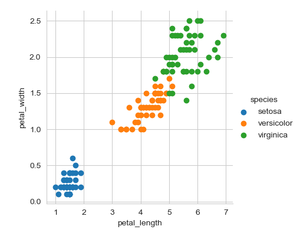

# 52167-Programming-Scripting_Project
## Introduction:

    This project will investigate the well-know Fishers Iris data set. The creation of a python program will allow for the delivery of  analysis for the data set. Using the python program, the we will be able to identfiy the differences between species of Iris.
## Running the code: 
    Navigate to the directory in which the python program currently resides. write the command python Fishers_Iris_Analysis_summary_Test.py to run the code. 
## Overview:
    The Iris is a species of flowering plants with showy flowers. In 1936 Ronald Fisher a british statistican and biologist used three Iris varieties to create the Iris flower data set to create a example of linear discriminant analysis. This was accumpilised by measuring the features of each species.      
## Summary Investigition to understand the dataset.
    The dataset used here is widely used to teach students techinques in statistics. the dataset is of good quality and without missing fields.
    [Wikipedia](https://en.wikipedia.org/wiki/Iris_flower_data_set.)
    linear discriminant analysis: 
    
    The dataset contains 150 entries of recorded values which were used to identify the different species of Iris.
    Using scatterplot 1 we see the seperation of the species. This two demisionational scatter plot shows the three different types of the species based on the features of the flower which we call independent variables or predictors. These are sepal length, sepal width, petal length, petal width. This means there are 4 dimensions.

   
Its clear to see that from the two scatter plots that there is a clear seperation between the blue points and the orange and green points. From this we can say that one type of species is clearly defined. The other two are not.  
 ## DataSet summary:
    ### About the data set
    The Iris flower data set or Fisher’s Iris data set is a multivariate data set introduced by the British statistician and biologist Ronald Fisher in his 1936 paper. This is a very famous and widely used dataset by everyone trying to learn machine learning and statistics. The data set consists of 50 samples from each of three species of Iris (Iris setosa, Iris virginica and Iris versicolor). Four features were measured from each sample: the length and the width of the sepals and petals, in centimetres. The fifth column is the species of the flower observed. 
    The dataset contains samples of three species of Iris:
        1.Iris setosa
        2.Iris virginica
        3.Iris versicolor
    The four features/independent variables that were measured to determine the species are: 
        1.sepals lenght
        2.sepals width
        3.petals lenght
        4.petals width
    There are 150 entries in total in the dataset
    
"Wikipedia", Fisher developed a linear discrimant model to distinguish the species from each other. 
The  term cluster analysis and the differences between supervised and unsupervised techniques in data mining.   
## Results
## Discussion
## Acknowledgments
## References
 * [Wikipedia](https://en.wikipedia.org/wiki/Iris_flower_data_set.)
   [making a scatterplot] (https://www.youtube.com/watch?v=GoVpgK1VzZU "make a scatterplot with python"). 
 
Notes: 
Summary is completed.
Task 2 to be completed: The program saves a histogram of each variable to png files.
Task 3 to be competed: The program outputs a scatter plot of each pair of varaibles.
