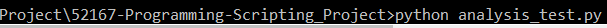
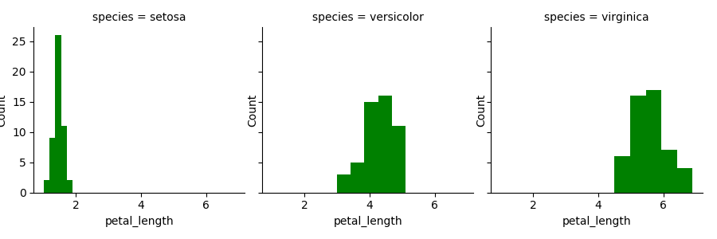
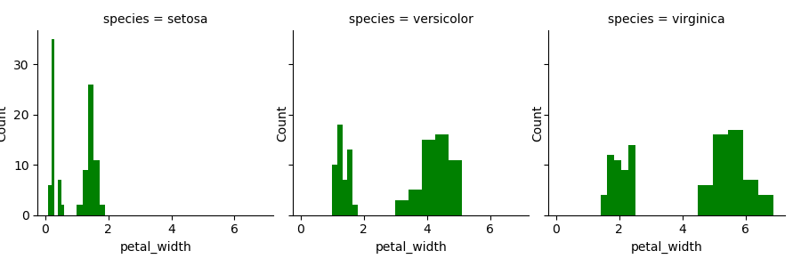
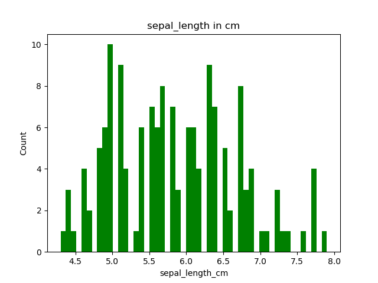
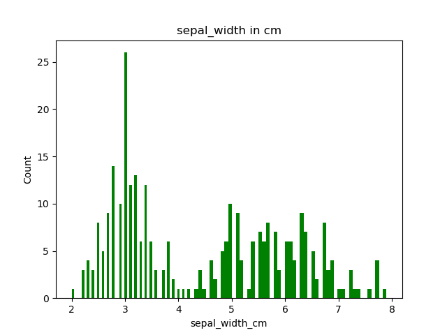
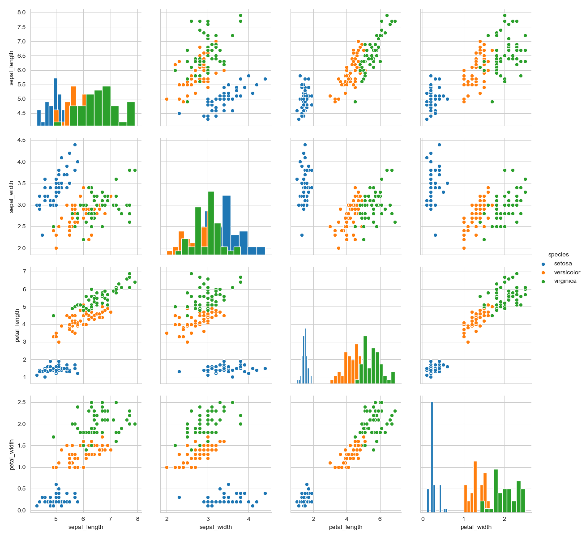

# Programming and Scripting 2020 Project

## Abstract

Using Python libraries imported into a python script to create a summary of each variable that included the Range, Mean, Median, Standard Deviation and the Quartiles. Each species variables displayed with Histograms, Scatterplots and Pair Plot.

The results of this investigation will show how using python to examine the Fishers Dataset can lead to a better and faster analysis.

## Introduction

This project is an investigation into the Fishers Iris Dataset. While this dataset is a corner stone in the data analysis this project will use it to present the usefulness of python in data analysis. This dataset is widely used to teach students techniques in statistics. The dataset is of good quality and without missing fields.

Objectives of this project will be to:

- Explain the benefits of using Python in the analysis of datasets.
- Present the results of data analysis using the Fishers dataset
- Research Fishers Linear Discriminant Analysis(LDA)
- To present the code that will show to the user the benefits of ease of use of python in data analysis.
- And to expand knowledge of data analysis and python.

This was accomplished by import various libraries into python using the Visual studio IDE, the project will be version controlled with Git hub. This project will be presented in such a way as to allow a person or group that are not familiar with python to grasp the ease of python when analysing data.

## Materials and Methods

1. Python:
  1. Pandas: this fast, powerful and flexible open source software used for data analysis and manipulation tool. [pandas](https://pandas.pydata.org/)
  2. Matplotlib: Is a library for creating static, animated and interactive visualization in Python. [matplotlib](https://matplotlib.org/)
  3. Numpy: This library is a fundamental package for scientific computing. [numpy](https://numpy.org/)
  4. Seaborn: Used in Python for data statistical data visualization library based on matplotlib. [seaborn](https://seaborn.pydata.org/)
2. Fishers Iris Dataset:
3. GitHub: [GitHub](https://github.com/donalMaher/52167-Programming-Scripting\_Project)
4. Running the code: Navigate to where you have download the python script via your command prompt run the command "python analysis_test.py" prerequisite, must have python installed on your computer.

## Results

The results of call the python script are shown here:

Histogram: petal length 

 

 
Pair Plot
 
Figure 8 Pair plot
Code 

## Discussion

### Investigation:

The analysis of the dataset will be a compressive summary of the data contained with.

The summary statistics:

There are four key areas is a summary

1. Centrality: the middle value or average
2. Dispersion: how the spread out the values are from the average
3. Replication: how many values there are in the sample
4. Shape: The data distribution.

#### Centrality:

The Average is an important measure is statically analysis. It gives an idea about where the data seems to be clustered around. In this summary the mean and the median was calculated.

1. Mean:

